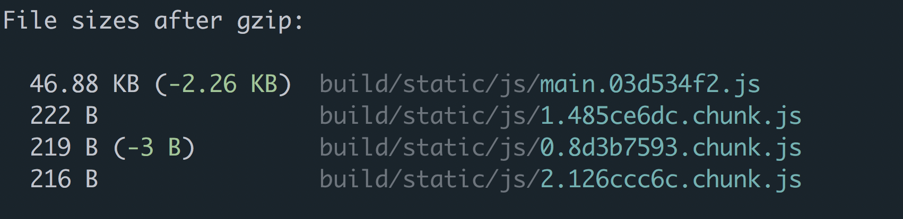

### Code Splitting

If there's one stereotype of JavaScript developers that holds true more often than it should, it's the lack of care for large bundle sizes. The problem is historically it's been too easy to bloat your JavaScript bundle and too hard to do anything about it.

Naturally, as you build your app, it gets larger. The larger it gets, the larger your bundle gets. The larger your bundle gets, the longer and more resources it takes to download. It's a vicious cycle that has plagued our industry for too long. To make it worse, since most developers have powerful laptops and fast internet connections, they never truly experience the pain they're causing for users with low-powered devices or slow internet.

Now, what if this didn't have to be the case? What if you could build your app without ever having to ship a larger bundle size to your users? Sounds too good to be true, but it's now possible through a feature called "Code Splitting".

The idea is simple, don't download code until the user needs it. Your users shouldn't have to download your entire app when all they need is a piece of it. If a user is creating a new post, it doesn't make sense to have them download all the code for the `/registration` route. If a user is registering, they don't need the huge rich text editor your app needs on the `/settings` route. It's wasteful and some would argue disrespectful to those users who don't have the privilege of unlimited bandwidth. Code Splitting has not only gained much more popularity in recent years, but it's also become exponentially easier to pull off.


If you're familiar with [ES modules](https://fireship.dev/c/react-router/'/advanced-javascrpt/javascript-modules-iifes-commonjs-esmodules'), you know that they're completely static. This means you must specify what you're importing and exporting at compile time, not run time. This also means that you can't dynamically import a module based on some condition. `import`s need to be declared at the top of your file or they'll throw an error.

```js
// 🚫 'import' and 'export' may only appear at the top level

if (!user) {
  import * as api from './api'
}
```

Now, what if `import` didn't **have** to be static? Meaning, what if the code above worked? What benefits would that give us?

First, it would mean we could load certain modules on demand. That would be powerful since it would enable us to get closer to the vision of only downloading code the user needs.

```js
if (editingPost === true) {
  import * as edit from './editpost'

  edit.showEditor()
}
```

Assuming `editpost` contained a pretty large rich text editor, we'd make sure we didn't download it until the user was actually ready to use it.

Another benefit would be better legacy support. You could hold off on downloading specific code until you were certain the user's browser didn't already have it natively.

```jsx
if (!window.Promise) {
  import './PromisePolyfill'
}
```

Here's the good news (that I kind of already alluded to earlier). This type of functionality does exist, it's supported by default with Create React App, and it's included in the ES2020 spec.

The difference is that instead of using `import` as you typically would, you use it **like** a function that returns a `Promise`. This `Promise` will resolve with the module once the module (line 51, module) is completely loaded.

```js
if (editingPost === true) {
  import('./editpost')
    .then((module) => module.showEditor())
    .catch((e) => )
}
```

Because Code Splitting allows you to split your code into various bundles, naturally, this is a bundler-level feature.

Though it works with Create React App out of the box, if you're not using CRA, you'll have to add it to your build process with whatever bundler you're using. Here's [a guide](https://webpack.js.org/guides/code-splitting/) to using it with Webpack.

Now that we know how to import modules dynamically, the next step is figuring out how to use it with React and React Router.


We'll start off with a basic React/React Router app. We'll have three components, `Home` (line 74, Home), `Topics` (line 75, Topics), `Settings` (line 76, Settings), which will map to our three routes, `/`, `/topics`, and `/settings`.

```jsx
import * as React from 'react'
import {
  BrowserRouter as Router,
  Routes,
  Route,
  Link,
} from 'react-router-dom'

import Home from './Home'
import Topics from './Topics'
import Settings from './Settings'

export default function App() {
  return (
    <Router>
      <div>
        <ul>
          <li><Link to='/'>Home</Link></li>
          <li><Link to='/topics'>Topics</Link></li>
          <li><Link to='/settings'>Settings</Link></li>
        </ul>

        <hr />

        <Routes>
          <Route path='/' element={<Home/>} />
          <Route path='/topics' element={<Topics/>} />
          <Route path='/settings' element={<Settings/>} />
        </Routes>
      </div>
    </Router>
  )
}
```

Now, say the marketing department got ahold of our `/settings` route and made it super bloated. They put in a rich text editor, an original copy of Super Mario Brothers, and an HD image of Guy Fieri. We don't want the user to have to download all of that when they're not on the `/settings` route.

We've already learned how Dynamic Imports can help us here, but there's one more piece to the code splitting puzzle we need to look at and that's `React.lazy`.

`React.lazy` takes in a single argument, a function that invokes a dynamic `import`, and returns a regular React Component.

```js
const LazyHomeComponent = React.lazy(
  () => import('./Home')
)

...

<LazyHomeComponent />
```

What's special about `LazyHomeComponent` is React won't load it until it's needed, when it's rendered. That means, if we combine `React.lazy` with React Router, we can hold off on loading any component until a user visits a certain `path`. More on that in a minute.

There's one more thing you need to remember when you're using `React.lazy` and it's related to what to show the user when React is loading the module. Because Dynamic Imports are asynchronous, there's an unspecified amount of time the user needs to wait before the component is loaded, rendered, and the UI is displayed.

To tell React what to show, you can use React's `Suspense` (lines 132 and 134, React.Suspense) component passing it a `fallback` (line 132, fallback) element.

```jsx
import * as React from 'react'
import Loading from './Loading'

const Settings = React.lazy(() => import('./Settings'))

function App () {
  return (
    <div>
      <React.Suspense fallback={<Loading />}>
        <Settings />
      </React.Suspense>
    </div>
  )
}
```

What's nice about `React.Suspense` is that `Suspense` can take in multiple, lazily loaded components while still only rendering one `fallback` element.

```jsx
import * as React from 'react'
import Loading from './Loading'

const AdDashboard = React.lazy(() => import('./AdDashboard'))
const Analytics = React.lazy(() => import('./Analytics'))
const Settings = React.lazy(() => import('./Settings'))

function App () {
  return (
    <div>
      <React.Suspense fallback={<Loading />}>
        <AdDashboard />
        <Analytics />
        <Settings />
      </React.Suspense>
    </div>
  )
}
```

Now let's update our app from earlier to utilize our newly found knowledge of Dynamic Imports, `React.lazy`, and `React.Suspense`.

```jsx
import * as React from 'react'
import {
  BrowserRouter as Router,
  Routes,
  Route,
  Link,
} from 'react-router-dom'

import Loading from './Loading'

const Home = React.lazy(() => import('./Home'))
const Topics = React.lazy(() => import('./Topics'))
const Settings = React.lazy(() => import('./Settings'))

export default function App () {
  return (
    <Router>
      <div>
        <ul>
          <li><Link to='/'>Home</Link></li>
          <li><Link to='/topics'>Topics</Link></li>
          <li><Link to='/settings'>Settings</Link></li>
        </ul>

        <hr />

        <React.Suspense fallback={<Loading />}>
          <Routes>
            <Route path='/' element={<Home/>} />
            <Route path='/topics' element={<Topics/>} />
            <Route path='/settings' element={<Settings/>} />
          </Routes>
        </React.Suspense>
      </div>
    </Router>
  )
}
```

How do we know this is actually working and code splitting our routes? If you were to run `npm run build` with an app created by Create React App, you'd see our app's being split into 3 `chunk`s.



Each `chunk` is a dynamic `import()` in our app. We have three since we're using `React.lazy` three times, with `Home`, `Topics`, and `Settings`.


Now it may be easy to fall into the trap of **only** code splitting your app at the route level, but it's important to understand that that's a false limitation.

Code splitting at the route level only is like brushing your teeth but never flossing. It's better than nothing, but there's still more progress you could make.

Instead of thinking about code splitting as splitting your app up by its routes, you should think of it as splitting your app up by its components (`Route`s are just components, after all). If you have a rich text editor that lives in a modal, splitting by the route only will still load the editor even if the modal is never opened.

At this point, it's more of a paradigm shift that needs to happen in your brain rather than any new knowledge. You already know how to dynamically import modules with `import()`, now you just need to figure out which components in your app you can hold off downloading until your user needs them.
