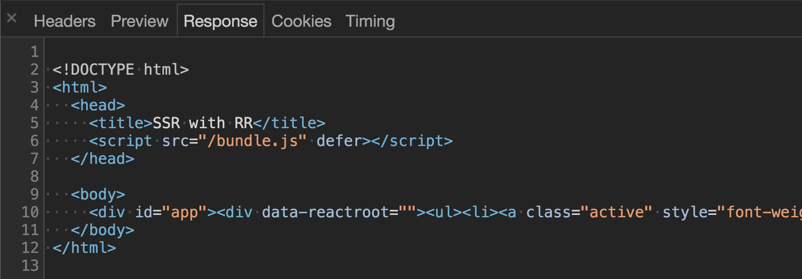
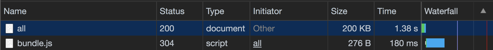

### Server Rendering

In thee beginning of the web, there were just documents with links between them. When a browser made a request to a server for a particular page, the server would find the HTML file stored on its hard disk for that page and send it back to the browser. There was no dynamic content, and there definitely wasn't any JavaScript. Just pages and links.

Not long after that, someone had the great idea to pre-process the HTML before it was sent to the client. The idea was simple - every time a browser requests a page, generate the HTML on-the-fly. Cookies, authentication headers, and form data could be used to tell the difference between requests, letting the browser generate different HTML for each request. This one innovation, which we now call server rendering, is what sparked the Web 2.0 era of the late 1990s and early 2000s.

Server rendering changed the game, but it wasn't without it's tradeoffs. The problem was every change in the page's content required a full-page refresh. That meant sending a request to the server, waiting for the server to generate the HTML, waiting for the request to come back, and then displaying the new HTML content. It worked, but it wasn't efficient.

Then in 1999 AJAX was invented to aid this problem. AJAX, which stands for "Asynchronous JavaScript and XML", allowed browsers to send and receive messages from the server using JavaScript without needing to reload the page. This ushered in the next era of rich, dynamically generated web apps - the most famous being Google Maps and Gmail.

About a decade later, another shift in the way we build web applications took place. The idea was simple, instead of consulting the server for every new page and then sprinkling in dynamic content with Ajax, what if we got everything we needed from the server on the initial request? This would make the whole app, especially route transitions, feel much quicker since we'd already have everything locally needed to render the new page without consulting a server. This concept even had its own name, "Single Page Applications" or SPAs, and it was popularized by JavaScript frameworks like Angular.js and React.

However, like all nice things, SPAs weren't without their tradeoffs. By bundling the entire application into a single payload, the entire JavaScript ecosystem became numb to the downsides of [large bundles](https://twitter.com/zachleat/status/1290998533106040833).

In this post, we'll take everything we've learned from the history of the web and apply it to building a modern, server-rendered React application. We'll see how, by minimizing the tradeoffs of each approach, we can improve the performance of our app with server-rendering while maintaining the "snappy" feel that SPAs enable.

#### Get the code
You can find all the code for this post on Github at [@uidotdev/react-router-server-rendering](https://github.com/uidotdev/react-router-server-rendering).

If server rendering is a new concept to you, it's important to grasp the big picture of how all the pieces fit together before diving into the details.


#### SSR - The Overview

1. A user types your URL into their web browser and hits enter
2. Your server sees there is a `GET` request
3. The server renders your React app to an HTML string, wraps it inside of a standard HTML doc (`DOCTYPE` and all), and sends the whole thing back as a response



4. The browser sees it got an HTML document back from the server and its [rendering engine](https://www.html5rocks.com/en/tutorials/internals/howbrowserswork/) goes to work rendering the page
5. Once done, the page is viewable and the browser starts downloading any `<script>`s located in the document



6. Once the scripts are downloaded, React takes over and the page becomes interactive


Notice that with server rendering, the response the browser gets from the server is raw HTML that is immediately ready to be rendered. This is the opposite of what happens with regular client-side rendering which just spits back a blank HTML document with a JavaScript bundle.

By sending back a finished HTML document, the browser is able to show the user some UI immediately without having to wait for the JavaScript the finish downloading.


Now that we get the big picture, let's work on creating the foundation for what will become a server-rendered React with React Router application.

Breaking down our list, we know there are three things we're going to need up front.


#### Our Immediate Needs

1. A React component - even just a basic one that renders "Hello World" for now
2. A server which spits back a React app after it's wrapped it in some HTML structure
3. A way for React to pick up from where the server-rendered HTML left off and add in any event listeners to the existing markup where needed


As always when dealing with React, we're going to need to talk about webpack at some point. For maximum knowledge gain, we're not going to use Create React App which means we'll have to roll our own configuration.

For the sake of keeping this tutorial as focused as possible, I'll paste the `webpack.config.js` file and the `package.json` file below then highlight the important parts.


#### Webpack Config

```js
const path = require('path')
const webpack = require('webpack')
const nodeExternals = require('webpack-node-externals')
const MiniCssExtractPlugin = require('mini-css-extract-plugin')

const browserConfig = {
  mode: "production",
  entry: './src/browser/index.js',
  output: {
    path: path.resolve(__dirname, 'dist'),
    filename: 'bundle.js'
  },
  module: {
    rules: [
      { test: /\.(js)$/, use: 'babel-loader' },
      { test: /\.css$/, use: [ 'css-loader' ]}
    ]
  },
  plugins: [
    new webpack.DefinePlugin({
      __isBrowser__: "true"
    })
  ]
}

const serverConfig = {
  mode: "production",
  entry: './src/server/index.js',
  target: 'node',
  externals: [nodeExternals()],
  output: {
    path: path.resolve(__dirname, 'dist'),
    filename: 'server.js'
  },
  module: {
    rules: [
      { test: /\.(js)$/, use: 'babel-loader' },
      {
        test: /\.css$/,
        use: [MiniCssExtractPlugin.loader, 'css-loader']
      }
    ]
  },
  plugins: [
    new MiniCssExtractPlugin(),
    new webpack.DefinePlugin({
      __isBrowser__: "false"
    }),
  ]
}

module.exports = [browserConfig, serverConfig]
```

Notice we have two different configurations, `browserConfig` for the browser and `serverConfig` for the server.

`browserConfig` is going to take the code that lives at `/src/browser/index.js`, run it through the `babel-loader` (which will run it through the `env` and `react` presets), run it through `css-loader` (which will allow us to `import` our CSS file), then spit out the modified, bundled code at `/dist/bundle.js`.

`browserConfig` also uses `DefinePlugin` to add an `__isBrowser__` property to the global namespace (`window`) so we know when we're in the browser.

`serverConfig` is similar. It's going to take the code that lives at `/src/server/index.js`, run it through the `babel-loader` and `css-loader`, then spit it out at `./dist/server.js`.

`externals` makes it so the server's `node_modules` aren't bundled with the output.

`target` tells webpack to compile for usage in a "Node.js like environment" and also helps `externals` know what to ignore (built in node modules like `path`, `fs`, etc).

`MiniCssExtractPlugin` is going to extract all our CSS into a single file then output it as `main.css` inside of the same `dist` folder.

tl;dr. The final client code is going to be bundled and put at `dist/bundle.js` and the final server code will be bundled and put at `dist/server.js`.

Next, let's take a quick look at our `package.json` file.

```json
{
  "name": "react-router-server-rendering",
  "description": "Server rendering with React Router.",
  "scripts": {
    "build": "webpack",
    "start": "node dist/server.js",
    "dev": "webpack && node dist/server.js"
  },
  "babel": {
    "presets": [
      "@babel/preset-env",
      "@babel/preset-react"
    ],
    "plugins": [
      "@babel/plugin-proposal-object-rest-spread"
    ]
  },
  "devDependencies": {
    "@babel/core": "^7.14.6",
    "@babel/plugin-proposal-object-rest-spread": "^7.14.7",
    "@babel/preset-env": "^7.14.7",
    "@babel/preset-react": "^7.14.5",
    "babel-loader": "^8.2.2",
    "css-loader": "^5.2.6",
    "mini-css-extract-plugin": "^2.0.0",
    "webpack": "^5.42.0",
    "webpack-cli": "^4.7.2",
    "webpack-node-externals": "^3.0.0"
  },
  "dependencies": {
    "cors": "^2.8.5",
    "express": "^4.17.1",
    "history": "^5.0.0",
    "isomorphic-fetch": "^3.0.0",
    "react": "^17.0.2",
    "react-dom": "^17.0.2",
    "react-router-dom": "^6.0.0-beta.0",
    "serialize-javascript": "^6.0.0"
  },
  "version": "1.0.0",
  "main": "index.js",
}
```

The big takeaway here is `npm run dev` will run `webpack && node dist/server.js` which tells Webpack to bundle our code and tells Node to start our node server.

The `build` and `start` commands are for hosting our server on a platform like Heroku.


Now that our build process is set up, let's build our app.

According to our `webpack.config.js` file, inside of our `src` folder, we're going to have a `server` folder and a `browser` folder.

Let's also add a `shared` folder for all the functionality which will be shared between the two.


Now if you'll remember when we broke down the initial SSR process, there were three items we were going to need first.


#### Our Immediate Needs

1. A React component - even just a basic one that renders "Hello World" for now
2. A server which spits back a React app after it's wrapped it in some HTML structure
3. A way for React to pick up from where the server-rendered HTML left off and add in any event listeners to the existing markup where needed


We can handle #1 pretty easily. Let's make an `App` component inside of the `shared/App.js` and have it render "Hello World".

```jsx
// src/shared/App.js

import * as React from 'react'

export default function App () {
  return (
    <div>
      Hello World
    </div>
  )
}
```

Done and done. Now, onto #2 - "A server which spits back a React app after it's wrapped it in some HTML structure".

First, let's create an `index.js` file inside of our `src/server` folder. We're going to use [express.js](https://expressjs.com/) so let's get the basics set up.

```js
// src/server/index.js

import express from "express"
import cors from "cors"

const app = express()

app.use(cors())
app.use(express.static("dist"))

const PORT = process.env.PORT || 3000

app.listen(PORT, () => {
  console.log(`Server is listening on port: ${PORT}`)
})
```

Simple enough. The biggest takeaway is that we're serving up our `dist` folder. If you remember from earlier, `dist` is where we have Webpack putting all our final bundled code.

Now we want to make it so anytime our server receives a `GET` request, we send back the HTML skeleton along with the markup from our `App` component inside of it. To do this, we'll use React's `renderToString` which takes in a React element and converts it into an HTML string.

```jsx
import express from "express"
import cors from "cors"
import ReactDOM from "react-dom/server"
import * as React from 'react'
import App from '../shared/App'

const app = express()

app.use(cors())
app.use(express.static("dist"))

app.get("*", (req, res, next) => {
  const markup = ReactDOM.renderToString(
    <App />
  )

  res.send(`
    <!DOCTYPE html>
    <html>
      <head>
        <title>SSR with React Router</title>
      </head>

      <body>
        <div id="app">${markup}</div>
      </body>
    </html>
  `)
})

const PORT = process.env.PORT || 3000

app.listen(PORT, () => {
  console.log(`Server is listening on port: ${PORT}`)
})
```

Lastly, we need to include a reference to our `bundle.js` file and our `main.css` file, both located in `dist`, and both created by Webpack.

```html
<head>
  <title>SSR with React Router</title>
  <script src="/bundle.js" defer></script>
  <link href="/main.css" rel="stylesheet">
</head>
```

Now whenever a `GET` request is made to our server, it'll send back some HTML which includes our `<App />` component, a `script` referencing the `bundle.js` file, and a `link` referencing the `main.css` file.

Next up, #3 - "A way for React to pick up from where the server-rendered HTML left off and add in any event listeners to the existing markup where needed".

This one sounds more difficult than it is. Typically when you want to tell the browser about your React app, you call `ReactDOM.render` passing it the element and the DOM node you want to render to.

```jsx
ReactDOM.render(
  <App />,
  document.getElementById('app)
)
```

Since we're initially rendering our app on the server, instead of calling `ReactDOM.render`, we want to call `ReactDOM.hydrate`.

```jsx
ReactDOM.hydrate(
  <App />,
  document.getElementById('app)
)
```

`hydrate` tells React that you've already created the markup on the server and instead of re-creating it on the client, it should preserve it, but attach any needed event handlers to it.

Let's make a new `index.js` file inside of `src/browser` where we can import our `App` component and call `hydrate` (line 327, hydrate).

```jsx
// src/browser/index.js

import * as React from 'react'
import ReactDOM from 'react-dom'
import App from '../shared/App'

ReactDOM.hydrate(
  <App />,
  document.getElementById('app')
)
```

Note that we're mounting `App` to an element with an `id` of `app`. This `coincides with` (line 346, id="app") the HTML that the server will respond with that we created earlier.

```jsx
res.send(`
 <!DOCTYPE html>
 <html>
   <head>
    <title>SSR with React Router</title>
    <script src="/bundle.js" defer></script>
    <link href="/main.css" rel="stylesheet">
   </head>

   <body>
      <div id="app">${markup}</div>
   </body>
 </html>
`)
```

At this point, assuming you've already ran `npm install` and `npm run dev`, when you visit `localhost:3000` you should see "Hello World".

That "Hello World" was initially rendered on the server then when it got to the client and the `bundle.js` file loaded, React took over.

Cool. Also, anticlimactic.


Let's mix things up a big so we can really see how this works. What if instead of rendering "Hello World", we wanted `App` to render `Hello {props.name}`.

```jsx
export default function App (props) {
  return (
    <div>
      Hello {props.name}
    </div>
  )
}
```

Now whenever we create our `App` element, we need to pass it a `name` prop - React 101.

To do this, we need to look at where we're creating the `App` element. There are two places, in `server/index.js` for when we server render and in of `browser/index.js` for when the browser picks it up.

Let's modify both of those and add a `name` prop of `Tyler`.

```jsx
// browser/index.js

ReactDOM.hydrate(
  <App name='Tyler' />,
  document.getElementById('app')
)
```

```jsx
// server/index.js

const markup = ReactDOM.renderToString(
  <App name='Tyler' />
)
```

Now when then app loads we see "Hello Tyler".


At this point we're successfully passing data to our `App` component, but now is a good opportunity to see the exact moment when React "hydrates" on the client. We can see this in action by continuing to pass `Tyler` to `name` on the server but switching the client `name` to another name, like `Mikenzi`.

```jsx
// server/index.js
const markup = ReactDOM.renderToString(
  <App name='Tyler' />
)

// browser/index.js
ReactDOM.hydrate(
  <App name='Mikenzi' />,
  document.getElementById('app')
)
```

Now when you refresh the app, you'll initially see `Hello Tyler`, which is what was rendered on the server, then when React takes over on the client, you'll see `Hello Mikenzi`.

Note that this is just for demonstration purposes only. If you were to look at the console, you'd actually see a warning -

> Text content did not match. Server: "Tyler" Client: "Mikenzi"

Here's what the React docs have to say about this.

#### Identical Rendering
"React expects that the rendered content is identical between the server and the client. It can patch up differences in text content, but you should treat mismatches as bugs and fix them. In development mode, React warns about mismatches during hydration. There are no guarantees that attribute differences will be patched up in case of mismatches. This is important for performance reasons because in most apps, mismatches are rare, and so validating all markup would be prohibitively expensive."

When you're just rendering a component with no data, it's not difficult to have the server-rendered and client rendered content be identical - as we saw when we just rendered `<App />`. When you add in data, it gets a little more complex. **You need to make sure that the component is rendered with the same data (or props) on both the client and server**.

So how would we go about doing this? We know since the app is going to be server rendered first, any initial data our app needs is going to have to originate on the server. With that in mind, in order to make sure the server and the client are the same, we need to figure out how to get the same data that originated on the server, down to the client.

Well, there's a pretty "old school" solution that works perfectly. Let's stick it on the global namespace (`window`) so the client can reference it when it picks up our app.

```jsx
...

import serialize from "serialize-javascript"

app.get("*", (req, res, next) => {
  const name = 'Tyler'
  const markup = renderToString(
    <App name={name}/>
  )

  res.send(`
    <!DOCTYPE html>
    <html>
       <head>
        <title>SSR with React Router</title>
        <script src="/bundle.js" defer></script>
        <link href="/main.css" rel="stylesheet">
        <script>
          window.__INITIAL_DATA__ = ${serialize(name)}
        </script>
       </head>

      <body>
        <div id="app">${markup}</div>
      </body>
    </html>
  `)
})
```

Now, on the client, we can grab the `name` from `window.__INITIAL_DATA__`.

```jsx
ReactDOM.hydrate(
  <App name={window.__INITIAL_DATA__} />,
  document.getElementById('app')
)
```

Cool. We've solved sharing initial data from the server to the client by using the `window` object.

At this point, we've covered all the fundamentals of server rendering. Let's take it a bit further now.


Odds are you're never going to have static initial data in your app. Your data will most likely be coming from an API somewhere. Let's modify our server so that it fetches some data before it returns the HTML. The end goal is to build something [like this](https://rrssr.ui.dev/), using the Github API to fetch popular repositories for a specific language.

The first thing we'll want to do is make a function that takes in a language and, using the Github API, fetches the most popular repos for that language. Because we'll be using this function on both the server and the client, let's make an `api.js` file inside of the `shared` folder and we'll call the function `fetchPopularRepos`.

```js
// shared/api.js

import fetch from 'isomorphic-fetch'

export function fetchPopularRepos (language = 'all') {
  const encodedURI = encodeURI(`
    https://api.github.com/search/repositories?q=stars:>1+language:${language}&sort=stars&order=desc&type=Repositories
  `)

  return fetch(encodedURI)
    .then((data) => data.json())
    .then((repos) => repos.items)
    .catch((error) => {
      console.warn(error)
      return null
    });
}
```

Now we need to figure out when to invoke this function. The idea is when a `GET` request is made to our server, instead of calling `renderToString` immediately, we first fetch the popular repositories then call it after giving our React component the fetched data.

```jsx
// src/server/index.js

...

import { fetchPopularRepos } from '../shared/api'

app.get("*", (req, res, next) => {
  fetchPopularRepos()
    .then((data) => {
      const markup = ReactDOM.renderToString(
        <App serverData={data} />
      )

      res.send(`
        <!DOCTYPE html>
        <html>
          <head>
            <title>SSR with React Router</title>
            <script src="/bundle.js" defer></script>
            <link href="/main.css" rel="stylesheet">
            <script>
              window.__INITIAL_DATA__ = ${serialize(data)}
            </script>
          </head>

          <body>
            <div id="app">${markup}</div>
          </body>
        </html>
      `)
    })
})
```

Now when a `GET` request is made to our server, we get back not only the React UI, but also the initial data coming from the Github API.

Next, let's update the `App` component to be able to properly handle the new `serverData` prop it's receiving. Instead of handling it all in `App`, let's make a new component called `Grid` that deals with mapping over all the repos.

```jsx
// src/shared/App.js
import * as React from 'react'
import Grid from './Grid'
import "./styles.css"

export default function App ({ serverData }) {
  return (
   <div>
     <Grid data={serverData} />
   </div>
  )
}
```

```jsx
// src/shared/Grid.js
import * as React from 'react'

export default function Grid ({ data }) {
  return (
    <ul className='grid'>
      {data.map(({name, owner, stargazers_count, html_url}, i) => (
        <li key={name}>
          <h2>#{i+1}</h2>
          <h3><a href={html_url}>{name}</a></h3>
          <p>by
            <a href={`https://github.com/${owner.login}`}>
              @{owner.login}
            </a>
          </p>
          <p>{stargazers_count.toLocaleString()} stars</p>
        </li>
      ))}
    </ul>
  )
}
```

Solid. Now when our app is requested, the server fetches the data the app needs and the HTML response we get has everything we need to render the initial UI.


At this point we've done a lot, but our app still has a long way to go, especially around routing.

React Router is a declarative, component-based approach to routing. However, because we're dealing with server-side rendering, we're going to abandon that paradigm and move all of our routes to a [central route configuration](https://fireship.dev/c/react-router/'https://ui.dev/c/react-router/react-router-route-config').

The reason for this is because both the client and the server are going to share the same routes. The client because it obviously needs to know which components to render as the user navigates around our app and the server because it needs to know which data to fetch when the user requests a specific path.

To do this, we'll make a new file inside of our `shared` folder called `routes.js` and in that represent our routes as an array of objects, each object representing a new route.

In the case of our app, we'll have two routes - `/` and `/popular/:id`. `/` will render the (soon to be created) `Home` (lines 594 and 600, Home) component and `/popular/:id` will render our `Grid` (lines 595 and 604, Grid) component.

```js
// src/shared/routes.js

import Home from './Home'
import Grid from './Grid'

const routes =  [
  {
    path: '/',
    component: Home,
  },
  {
    path: '/popular/:id',
    component: Grid,
  }
]

export default routes
```

Before we continue, let's hurry and create the `Home` component. It'll simply render an `h2` element.

```jsx
// src/shared/Home.js

import * as React from 'react'

export default function Home () {
  return (
    <h2 className='heading-center'>
      Select a Language
    </h2>
  )
}
```

Now I mentioned earlier that the reason the server needs to have access to a central route config is because "it needs to know which data to fetch when the user requests a specific path". What that means is that we're going to put any data requests that a specific route needs in the route object itself.

What that will do is it will allow the server to say "It looks like the user is requesting the `/popular/javascript` route. Is there any data that needs to be fetched before we send back a response? There is? OK fetch it.".

```js
// shared/routes.js

import Home from './Home'
import Grid from './Grid'
import { fetchPopularRepos } from './api'

const routes =  [
  {
    path: '/',
    component: Home,
  },
  {
    path: '/popular/:id',
    component: Grid,
    fetchInitialData: (path = '') =>
      fetchPopularRepos(path.split('/').pop())
  }
]

export default routes
```

Again, by adding a `fetchInitialData` property to our `/popular/:id` route, when a user makes a `GET` request with that path, we'll know we need to invoke `fetchInitialData` before we can send a response back to the client.

Let's head back over to our server and see what these changes will look like.

The first thing we need to do is figure out which route, if any, match the current request to the server. For example, if the user requests the `/` page, we need to find the route with the `path` of `/`. Luckily for us, React Router exports a `matchPath` (lines 665 and 670, matchPath) method that does exactly this.

```js
// server/index.js

...

import { matchPath } from "react-router-dom"
import routes from '../shared/routes'

app.get("*", (req, res, next) => {
  const activeRoute = routes.find((route) =>
    matchPath(route.path, req.url)
  ) || {}

})

...
```

Now, `activeRoute` will be the route of whatever page the user was requesting (`req.url`).

The next step is to see if that route requires any data. We'll check if the `activeRoute` has a `fetchInitialData` property. If it does, we'll invoke it passing it the current path, if it doesn't, we'll just continue on.

```js
app.get("*", (req, res, next) => {
  const activeRoute = routes.find((route) =>
    matchPath(route.path, req.url)
  ) || {}

  const promise = activeRoute.fetchInitialData
    ? activeRoute.fetchInitialData(req.path)
    : Promise.resolve()

  promise.then((data) => {

  }).catch(next)
})
```

Now we have a promise which is going to resolve with the data, or nothing. As we've done previously, we want to grab that and both `pass it` (line 712, serverData) to our component as well as `put it` on the window object so the client can pick it up later.

```js
app.get('*', (req, res, next) => {
  const activeRoute = routes.find((route) =>
    matchPath(route.path, req.url)
  ) || {}

  const promise = activeRoute.fetchInitialData
    ? activeRoute.fetchInitialData(req.path)
    : Promise.resolve()

  promise.then((data) => {
    const markup = ReactDOM.renderToString(
      <App serverData={data} />
    )

    res.send(`
      <!DOCTYPE html>
      <html>
        <head>
          <title>SSR with React Router</title>
          <script src="/bundle.js" defer></script>
          <link href="/main.css" rel="stylesheet">
          <script>
            window.__INITIAL_DATA__ = ${serialize(data)}
          </script>
        </head>

        <body>
          <div id="app">${markup}</div>
        </body>
      </html>
    `)
  }).catch(next)
})
```

Getting closer. Now instead of always fetching the repos, we’re only fetching them if the route that is being rendered has a `fetchInitialData` property.


Now that we're fetching the correct data on our server based on the route the user requested, let's add in some client-side routing as well.

As always, we need to wrap our main component (`App`) inside of React Router's `BrowserRouter` (lines 747, 750 and 752, BrowserRouter) component on the client. We'll do that inside of `src/browser/index.js` since that's where we're rendering `App`.

```jsx
import * as React from 'react'
import ReactDOM from 'react-dom'
import App from '../shared/App'
import { BrowserRouter } from 'react-router-dom'

ReactDOM.hydrate(
  <BrowserRouter>
    <App />
  </BrowserRouter>,
  document.getElementById('app')
);
```

Now, because we've given control of the client over to React Router, we also need to do the same on the server so they match. Because we're on the server, it doesn't make sense to render a component called `BrowserRouter`. Instead, we'll use React Router's `StaticRouter` component.

It's called `StaticRouter` since the location never actually changes. It takes one required prop, `location`, which is the current location being requested by the user (`req.url`).

```jsx
// server/index.js

...

import { StaticRouter } from 'react-router-dom/server';

...

const markup = ReactDOM.renderToString(
  <StaticRouter location={req.url} >
    <App serverData={data} />
  </StaticRouter>
)

...
```

Now before we render our client-side `Route`s, let's create a few more components that we'll need – `Navbar`, `ColorfulBorder`, and `NoMatch`. We'll copy/paste these since there isn't anything related to server rendering happening here.

```jsx
// src/shared/ColorfulBorder.js
import * as React from 'react'

export default function ColorfulBorder() {
  return (
    <div className='border-container' />
  )
}
```

```jsx
// src/shared/NoMatch.js
import * as React from 'react'

export default function NoMatch () {
  return <h2 className='heading-center'>Four Oh Four</h2>
}
```

```jsx
// src/shared/Navbar.js
import * as React from 'react'
import { NavLink } from 'react-router-dom'

const languages = [
  {
    name: 'All',
    param: 'all'
  },
  {
    name: 'JavaScript',
    param: 'javascript',
  },
  {
    name: 'Ruby',
    param: 'ruby',
  },
  {
    name: 'Python',
    param: 'python',
  },
  {
    name: 'Java',
    param: 'java',
  }
]

export default function Navbar () {
  return (
    <ul className='nav'>
      {languages.map(({ name, param }) => (
        <li key={param}>
          <NavLink
            activeStyle={{fontWeight: 'bold'}}
            to={`/popular/${param}`}>
              {name}
          </NavLink>
        </li>
      ))}
    </ul>
  )
}
```

Now let's render some client-side routes. We already have our `routes` array, so we just need to map over that to create our `Route`s. We also need to make sure that we pass the component that is being rendered the `fetchInitialData` property, if it exists, so the client can invoke it if it doesn't already have the data from the server.

```jsx
// src/shared/App.js

import * as React from 'react'
import routes from './routes'
import { Route, Routes } from 'react-router-dom'
import Navbar from './Navbar'
import NoMatch from './NoMatch'
import ColorfulBorder from './ColorfulBorder'
import './styles.css'

export default function App ({ serverData=null }) {
  return (
    <React.Fragment>
      <ColorfulBorder />
      <div className='container'>
        <Navbar />
        <Routes>
          {routes.map((route) => {
            const {
              path,
              fetchInitialData,
              component: C
            } = route;

            return (
              <Route
                key={path}
                path={path}
                element={
                  <C
                    data={serverData}
                    fetchInitialData={fetchInitialData}
                  />
                }
              />
            )
          })}
          <Route path='*' element={<NoMatch />} />
        </Routes>
      </div>
    </React.Fragment>
  )
}
```

At this point our app is coming along nicely, but there's one glaring issue. As is, the app works on the initial render, but any subsequent route transitions would break. Any idea why?

It's because the only place we're fetching the repo's data is on the server, and no where on the client. When the user first loads our app and gets the response from the server, the app contains all the markup and data it needs to render. Then, as the user navigates around the app, since we're using React and React Router, no subsequent requests to our server are made and no more repo data is fetched.

Said differently, you can think of our app as having three phases - server rendered → client pickup → client navigation. Anything that happens after "client pickup" is in the hands of React and React Router. What this means is that just because we fetched the initial data on the server, that doesn't mean that data is going to be valid throughout the whole lifetime of the user using our app. As soon as the user navigates away from the initial server rendered page, we need to have our client code be responsible for fetching any new pieces of data it needs.

To do this, naturally, we need to fetch repo data from the client only if we don't already have the data from the server. To do this, we need to know if we're rendering on the client, and if we are, if it's the initial render. If it is, that would mean we already have the data via `window.__INITIAL_DATA__` and we shouldn't fetch it again.

If you remember way back to the start of this post, in our `browserConfig` in our webpack config file, we used `webpack.DefinePlugin` to add a `__isBrowser__` property to `window` on the client. This is how we can tell if we're rendering on the client or on the server.

Using that, let's add a local `repos` state to our `Grid` component whose default value will be `window.__INITIAL_DATA__` if we're on the client or the `data` prop if we're on the server.

```jsx
// src/shared/Grid.js

export default function Grid ({ data }) {
  const [repos, setRepos] = React.useState(() => {
    return __isBrowser__
      ? window.__INITIAL_DATA__
      : data
  })


  ...
}
```

Now that we have `repos`, our main goal is to keep it up to date with whatever language the user selects.

If you'll remember, the `Route` for our `Grid` component looks like this.

```js
{
  path: '/popular/:id',
  component: Grid,
  fetchInitialData: (path = '') =>
    fetchPopularRepos(path.split('/').pop())
}
```

We're using a [URL Parameters](https://fireship.dev/c/react-router/'/react-router/react-router-url-parameters') (`id` (line 927, '/popular/:id')) to represent the `language` (line 948, id). We can get access to that URL parameter, and therefore the language, via React Router's `useParams` (lines 939 and 948, useParams) Hook.

```jsx
// src/shared/Grid.js

import { useParams } from 'react-router-dom'

export default function Grid ({ data }) {
  const [repos, setRepos] = React.useState(() => {
    return __isBrowser__
      ? window.__INITIAL_DATA__
      : data
  })

  const { id } = useParams()


  ...
}
```

Now that we have our `repos` state and we've grabbed the language from the URL parameter, the next thing we need to do is figure out how to fetch that language's repos and update our local `repos` state. To help us do that, let's add a `loading` state to our component.

`loading`, naturally, will let us know if we're currently in the process of fetching new repositories. Initially, we want `loading` (lines 969 and 973, loading) to be `false` (line 970, false) if we already have `repos` (lines 961 and 970, repos), which means they were created on the server.

```jsx
export default function Grid ({ data }) {
  const [repos, setRepos] = React.useState(() => {
    return __isBrowser__
      ? window.__INITIAL_DATA__
      : data
  })

  const { id } = useParams()

  const [loading, setLoading] = React.useState(
    repos ? false : true
  )

  if (loading === true) {
    return <i className='loading'>🤹‍♂️</i>
  }

  ...
}
```

Finally, whenever the user selects a new language from our Navbar, we want to fetch the new popular repositories for that language and update our `repos` state. To fetch the new popular repositories, we can use the `fetchInitialData` (line 991, fetchInitialData) prop that we passed in when we created our `Route`s.

```jsx
{routes.map(({path, fetchInitialData, component: C}) => (
  <Route
    key={path}
    path={path}
    element={
      <C
        data={serverData}
        fetchInitialData={fetchInitialData}
      />
    }
  />
))}
```

The next question is when should we invoke `fetchInitialData`? If you're familiar with the `useEffect` Hook, you'll know you can pass to it an array of dependencies as its second argument. Whenever one of the elements in the array changes, React will re-apply the effect. That means if we pass our `id` URL parameter as an element in the effect's dependency array, React will only re-apply the effect when it changes. Perfect.

```jsx
export default function Grid ({ fetchInitialData, data }) {
  const [repos, setRepos] = React.useState(() => {
    return __isBrowser__
      ? window.__INITIAL_DATA__
      : data
  })

  const [loading, setLoading] = React.useState(
    repos ? false : true
  )

  const { id } = useParams()

  React.useEffect(() => {
    setLoading(true)

    fetchInitialData(id)
      .then((repos) => {
        setRepos(repos)
        setLoading(false)
      })
  }, [id])

  if (loading === true) {
    return <i className='loading'>🤹‍♂️</i>
  }

  return (
    <ul className='grid'>
      ...
    </ul>
  )
}
```

And just like like, we're done...almost.

Can you spot any issues with our current implementation of `Grid`? Here's a hint - it has to do with our effect.

By default, React will invoke the effect after the **first** render of the component and then anytime an element in the dependency array changes. Typically this is fine, _except_ in our case. We only want to run the effect on the initial render if `repos` is falsy. Similar to `loading`, if `repos` isn't falsy that means that they were created on the server and there's no use in re-fetching them. To solve this, we'll use React's `useRef` Hook.

#### useState vs useRef
Put simply, `useRef` is similar to `useState` in that it lets us persist a value across renders, but unlike `useState`, `useRef` won't trigger a re-render. This is helpful in our case because we don't want to cause a re-render of the component when we update our ref's value.

For more info, visit [Understanding React's useRef Hook](https://fireship.dev/c/react-hooks/useref).

```jsx
export default function Grid ({ fetchInitialData, data }) {
  const [repos, setRepos] = React.useState(() => {
    return __isBrowser__
      ? window.__INITIAL_DATA__
      : data
  })

  const [loading, setLoading] = React.useState(
    repos ? false : true
  )

  const { id } = useParams()

  const fetchNewRepos = React.useRef(
    repos ? false : true
  )

  React.useEffect(() => {
    if (fetchNewRepos.current === true) {
      setLoading(true)

      fetchInitialData(id)
        .then((repos) => {
          setRepos(repos)
          setLoading(false)
        })
    } else {
      fetchNewRepos.current = true
    }
  }, [id, fetchNewRepos])

  ...
}
```

On the initial render of `Grid`, we set our `fetchNewRepos` ref to `false` if `repos` is `truthy` and `true` if it's `falsy`. Then inside the effect we can check to see what the value of `fetchNewRepos` is (via `fetchNewRepos.current`). If it's `true`, we need to fetch the new languages `repos`. If it isn't `true`, that means it's the initial render and we've already fetched the `repos` on the server. We then set `fetchNewRepos.current` to `true` so that an subsequent renders will trigger a fetching of the new language's popular repos as normal.

And with that, we're finished! The first request will be server rendered and every subsequent route transition after that React and React Router will own as normal.


If you've made it this far, great job. Server rendering with React, as you've seen, is no simple task as React wasn't built with it in mind. In fact, if you're application truly needs server rendering, I'd check out [Next.js](https://nextjs.org/) or [Blitz.js](https://blitzjs.com/) which are meta frameworks built on top of React with much more sensible approaches to server rendering (and more).


---------------------------------------------------------------------------------

Comments:

- I have something to add:

1 - Since ReactDOM.hydrate() is now deprecated in React 18, should I use the following code instead?

```jsx
import * as React from "react";
import { hydrateRoot } from "react-dom/client";
import App from "../shared/App";

const container = document.getElementById("app");
hydrateRoot(container, <App />);
```

2 - The link to "central route configuration" is wrong; it should go to https://ui.dev/c/react-router/react-router-route-config.

3 - If you are using React Router v6, the `activeStyle` prop has been removed. Instead, you can use the `style` prop with a function to conditionally apply styles based on the link's active state.

For example:

```jsx
<li key={param}>
  <NavLink
    style={({ isActive }) => ({
      fontWeight: isActive ? "bold" : "normal",
    })}
    to={`/popular/${param}`}
  >
    {name}
  </NavLink>
</li>
```
